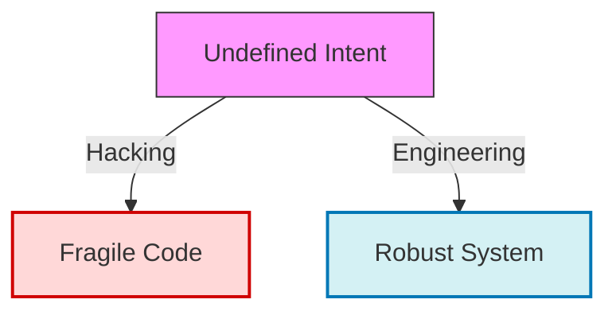
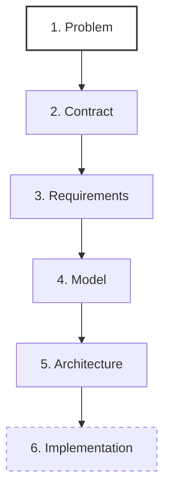

# Basics of Software Engineering
## Foundational Course — Thinking Like an Engineer (Before Code)

---

## Course Objective

This document has a precise goal: to **shape the engineering mindset** before any consideration of language, framework, or database.

It is designed to be:
- Professional
- Shareable among developers
- Immediately applicable to real projects

**No specific technology is mentioned.**

### Visualizing the Mindset Shift

#### Diagram Analysis
*   **Undefined Intent (Pink)**: Starting work with only a vague idea ("I want a chat app").
*   **Hacking Path (Red)**: Jumping straight to coding. Result is **Fragile Code**—it works today but breaks tomorrow when requirements change.
*   **Engineering Path (Blue)**: Applying methodology (Design, Contract). Result is a **Robust System**—predictable, scalable, and maintainable.

---

## 1. Software Engineering: Operational Definition

### 1.1 Real-World Analogy

> **The Architect's Blueprint**
> 
> A construction worker places bricks. An **architect** designs the structure so it doesn't collapse under wind load. 
> If you start placing bricks without a blueprint, you might build a wall, but you won't build a safe skyscraper.
> 
> **Coding is placing bricks. Engineering is designing the blueprint.**

### 1.2 Definition

Software engineering is **not** writing code.

> **Software Engineering is the act of designing correct, understandable, and maintainable systems *before* their implementation.**

The code is merely a consequence.
- A **developer** produces code.
- An **engineer** produces **durable decisions**.

**What is a "Durable Decision"?**
It is a decision that is hard to reverse later.
*   *Reversible*: Variable names, folder structure, styling. (Low Engineering cost)
*   *Durable*: Data model, API contract, security guarantees. (High Engineering cost)

---

## 2. The Fundamental Principle

> **An unspecified system is a broken system.**

Without clear specification:
- **Decisions are inconsistent**: Developer A uses SQL, Developer B uses JSON files.
- **Architecture drifts**: The system becomes a "Big Ball of Mud".
- **Technical debt is inevitable**: You spend more time fixing old bugs than writing new features.

---

## 3. The System Contract

### 3.1 Definition

The **System Contract** is the set of guarantees the system provides to its users and external systems, along with the constraints they must respect.

It is independent of:
- Language (Python, Go, JS)
- Database (SQL, NoSQL)
- Framework (React, Django)

### 3.2 Role

The contract answers four fundamental questions:
1.  **Who interacts?** (Actors) -> e.g., Admin, Customer, API Client.
2.  **What is allowed?** (Capabilities) -> e.g., "Create Order", "Refund Item".
3.  **What is guaranteed?** (Invariants) -> e.g., "Refund can never exceed Order value".
4.  **What is forbidden?** (Explicit refusals) -> e.g., "Deleting an Order with active payments".

---

## 4. The Toolset: PRD & SRS

### 4.1 PRD (Product Requirements Document)
Formalizes the **Reason for Existence**.

-   **Analogy**: The "Client Brief" in architecture ("I need a 4-bedroom house").
-   **Question**: *Why does this system exist?*
-   **Content**: Problem, Users, Scope, Success Criteria.

### 4.2 SRS (Software Requirements Specification)
Translates the vision into **Verifiable Requirements**.

-   **Analogy**: The "Technical Blueprints" (HVAC schematics, Load-bearing calculations).
-   **Question**: *What must the system guarantee?*
-   **Content**: Requirements, Rules, Error States (Normative vocabulary: MUST, MUST NOT).

---

## Decision Hierarchy

You must strictly follow this order. Inverting it leads to fragile systems.

#### Legend & Detailed Flow
1.  **Problem (PRD)**: We define *why*. If this is wrong, everything below provides the right solution to the wrong problem.
2.  **Contract**: We define the boundaries. What goes in, what comes out.
3.  **Requirements (SRS)**: We define the rules. The "Laws" of the system.
4.  **Model (UML)**: We visualize the behavior.
5.  **Architecture (C4)**: We structure the components to support that behavior.
6.  **Code**: We type the solution into files. notice how low this is?

---

## Conclusion

Thinking like a software engineer means:
-   **Defining** before coding.
-   **Clarifying** before implementing.
-   **Modeling** before optimizing.

**Code is replaceable. The Contract is not.**

---

This document constitutes the **mandatory foundation** before reading **[01_requirements_prd.md](./01_requirements_prd.md)**.
