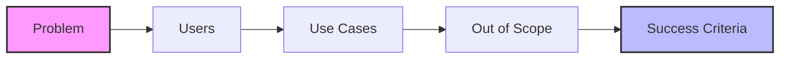

# Course — Writing a PRD (Product Requirements Document)
## Software Engineering Foundations — Sequence 01

---

## Course Objective

This course teaches **how to design and write a PRD** methodically.
It does not provide a ready-made PRD. It provides **the engineering method to produce one** for any project.
A PRD is often confused with a "Wishlist". It is actually a **Problem Definition**.

---

## 1. Role of the PRD in Engineering

A PRD is a **clarification tool**, not a decorative document.
It answers a single unique question:

> **Why must this system exist?**

As long as this question has no written and shared answer, **no technical decisions should be made**.

### Real-World Analogy

> **Diagnosis vs. Prescription**
>
> A doctor (Engineer) never prescribes medication (Code) without a clear diagnosis (PRD).
>
> *   **PRD**: "The patient has a bacterial infection." (The Problem) - *Observations, Symptoms, Causes.*
> *   **Architecture**: "We need an antibiotic." (The Strategy) - *Treatment plan.*
> *   **Code**: "Amoxicillin 500mg." (The Implementation) - *Execution.*
>
> If you start coding without a PRD, you are a surgeon operating without a diagnosis. You might remove a healthy kidney.

---

## 2. What a PRD is NOT

A PRD is **NOT**:
-   A list of features ("It needs a login button").
-   A technical description ("It's a React App").
-   A projection of the solution ("It uses MongoDB").
-   An anticipation of architecture ("It's Microservices").

**Any technical information in a PRD is a scope error.** It limits your future choices unnecessarily.

---

## 3. Fundamental Principle

> **A PRD freezes the problem, not the solution.**

A good PRD remains valid even if:
-   The language changes from Java to Go.
-   The architecture changes from Monolith to Serverless.
-   The team changes completely.

---

## 4. Minimal Structure

A PRD must strictly contain the following sections.

### Diagram Analysis
1.  **Problem (Pink)**: The root cause. Everything flows *from* here. If this is fuzzy, the Use Cases will be useless.
2.  **Users**: You can't define "Use Cases" if you don't know *who* is using it.
3.  **Out of Scope**: Defining what you *won't* do is as important as what you *will* do.
4.  **Success Criteria (Blue)**: The check at the end. Did we solve the Pink node?

### 4.1 The Problem
Describe the real, observable problem, independent of any solution.

**Guiding Question:**
> *What dysfunction exists today without this system?*

*Bad Example*: "We need a faster website." (This is a solution/desire).
*Good Example*: "Users currently wait 14 seconds for reports to load, leading to a 40% abandonment rate." (This is a problem).

### 4.2 Target Users
Identify **who suffers from the problem**.
(Real actors, not marketing personas).

**Guiding Question:**
> *Who actually needs the system?*

### 4.3 Main Use Cases
List the **legitimate actions** the system must allow.

**Guiding Question:**
> *What must the user be able to do (without describing how)?*

### 4.4 Out of Scope
Explicitly define what the system **will not do**.

**Guiding Question:**
> *What would be tempting but harmful to the system scope?*

*Example*: "The system will NOT handle payment processing; it relies on Stripe."

### 4.5 Success Criteria
Define the conditions to affirm the system fulfills its role.

**Guiding Question:**
> *How do we know the problem is actually solved?*

---

## 5. Common Pitfalls

-   **Solutioneering**: Introducing solutions inside the definition of the problem. (e.g., "The problem is we don't have a Blockchain").
-   **Lazy Scope**: Forgetting to define "Out of Scope" items. This leads to "Scope Creep" where features multiply forever.
-   **Vagueness**: Using terms like "user-friendly" or "fast" without metrics. "Fast" is an opinion. "Under 100ms" is a requirement.

An overly rich PRD is a dangerous PRD. It restricts creativity.

---

## 6. Validation Criteria

A PRD is valid if:
1.  **Two engineers can propose completely different architectures** based on the same document. (One suggests a Mobile App, another a Web Dashboard - both fix the problem).
2.  If only one solution is possible, the PRD is biased.

---

## 7. Expected Result

At the end of this course, an engineer must be able to:
-   Formulate a problem without a solution.
-   Delimit a clear scope.
-   Produce a stable PRD.

---

This course constitutes the **mandatory methodological foundation** before writing an **SRS** ([Sequence 02](./02_requirements_srs.md)).
