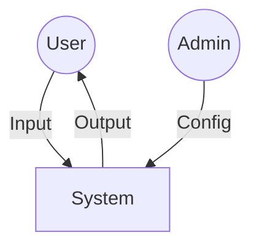

# Course — Writing an SRS (Software Requirements Specification)
## Software Engineering Foundations — Sequence 02

---

## Course Objective

This course teaches **how to transform a product vision (PRD)** into **precise, verifiable, and unambiguous software requirements**.
It provides the engineering method to write the "System Constitution".

---

## 1. Role of the SRS in Engineering

The SRS is the **Technical Contract** of the system.
It answers the question:

> **What must the system do, exactly, without describing how?**

### Real-World Analogy

> **The Legal Contract**
>
> A PRD is like a handshake agreement: "I'll paint your house."
> An SRS is the **signed contract**: "The contractor MUST apply two coats of Grade A Latex Paint (Color #FFF) to all exterior surface areas exceeding 10x10cm."
>
> *   **Ambiguity is a lawsuit.** If a lawyer writes "do a good job", they get sued.
> *   **In engineering, ambiguity is a bug.** If you write "should load fast", you get a slow system.

---

## 2. Fundamental Difference: PRD vs. SRS

*   **PRD**: *Why* the system exists. (Fuzzy, Visionary). Focus: **Value**.
*   **SRS**: *What* the system guarantees. (Binary, Strict). Focus: **Compliance**.

The PRD accepts some fuzziness. The SRS **tolerates zero ambiguity**.

---

## 3. Fundamental Principle

> **A requirement that cannot be verified is not a requirement.**

Each element of the SRS must be:
-   **Validatable**: Can we prove it's needed?
-   **Testable**: Can we write a Unit Test or Integration Test for it?
-   **Contestable**: Can someone argue it's wrong? (If it's too vague to be wrong, it's useless).

---

## 4. Minimal Structure

### 4.1 Actors
Identify all agents capable of interacting with the system (Humans or Systems).

**Visual Structure:**

#### Diagram Analysis
*   **Circles (User/Admin)**: These are outside the system. We can't control them. They *act*.
*   **Square (System)**: This is our Black Box. We only define how it *reacts* to inputs.
*   **Arrows**: These represent the **Interface Boundaries**. The SRS defines strictly what passes through these arrows.

### 4.2 Features (Functional Requirements)
Describe what the system allows.

**Format**:
> The System **MUST** allow [Actor] to [Action].

### 4.3 Business Rules
Describe internal constraints governing behavior.

**Rule**:
> Independent of implementation, applicable in all circumstances.

### 4.4 Non-Functional Constraints
Security, Performance, Reliability.

### 4.5 Error Cases
Describe invalid situations and the expected response.

**Guiding Question**:
> *What happens if the database is down? What if the input is empty?*

---

## 5. Normative Vocabulary

To avoid ambiguity, use RFC 2119 keywords. This is the **Language of Engineers**.

| Keyword | Meaning | Engineer's Translation |
|:---|:---|:---|
| **MUST** | Absolute obligation. | "If this doesn't happen, throw a Fatal Error / Page Down." |
| **MUST NOT** | Absolute prohibition. | "Block this in code. Return HTTP 403 Forbidden." |
| **SHOULD** | Strong recommendation. | "Do it, unless there is a valid technical reason not to." |
| **MAY** | Optional. | "Nice to have, but don't delay the release for it." |

**Example**:
- *Bad*: "The system should be fast." (Subjective)
- *Good*: "The server **MUST** respond to API calls within 200ms." (Testable: `assert(time < 200ms)`)

---

## 6. Common Pitfalls

-   **Implementation Leakage**: Mentioning SQL, React, or specific algorithms. (e.g., "Must use a `for` loop"). **Why is it bad?** Because if a better algorithm comes along, your requirement becomes obsolete.
-   **Vague Adjectives**: "Easy", "Fast", "Modern". These mean nothing to a compiler.
-   **Missing Negatives**: Forgetting to define what the system **MUST NOT** do. (e.g., "Users MUST NOT be able to view others' data").

---

## 7. Expected Result

At the end of this course, an engineer must be able to:
-   Write verifiable requirements.
-   Transform a PRD into technical rules.
-   Produce a stable software contract.

---

This course constitutes the **mandatory methodological foundation** before **[03_design_contract_invariants.md](./03_design_contract_invariants.md)**.
