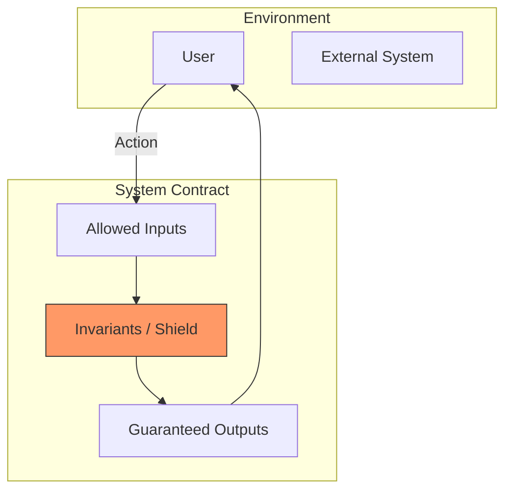

# Course — System Contract & Invariants
## Engineering Foundations — Sequence 03

## Objective

Before any UML or C4 modeling, we must understand **what the system promises and forbids**, which rules must **always be true**, and what constraints structure the system.

**Deliverables of Sequence 03**
-   System Contract Document
-   Abstract Dependency List
-   Coherence Checklist

---

## 1. The System Contract

The contract is not legal; it is a **promise between the system and its environment**.

### 1.1 Real-World Analogy

> **The Electrical Grid**
>
> The power grid has a contract:
> *   **Promise**: Deliver 230V at 50Hz.
> *   **Invariant**: Frequency must never drop below 49.5Hz.
> *   **Forbidden**: Sending 10,000V to a residential socket.
>
> Regardless of whether the power comes from nuclear, wind, or coal (Implementation), **the contract remains the same**.
> A software contract is the same: "I guarantee to store your data safely, regardless of whether I use Postgres or Mongo."

### 1.2 Central Questions

1.  **Who interacts?** (Actors: Admins, Users, APIs)
2.  **What is promised?** ( Capabilities)
3.  **What is guaranteed?** (Invariants)
4.  **What is forbidden?** (Strict Constraints)

---

## 2. Invariants & Constraints

### 2.1 Invariants
Rules that **must never change**, despite refactors or stack changes. They are the **Laws of Physics** of your system.

*   *Example*: "A transaction ID must be unique forever."
*   *Example*: "An administrator cannot delete their own account." (To prevent locking strictly).

### 2.2 Technical Constraints
Limits the design must respect. These are the **Walls** of your system.

*   *Example*: "Must run in an offline environment." (Constraint -> Determines Architecture).
*   *Example*: "Max memory usage: 512MB." (Constraint -> Optimization strategy).

---

## 3. Visualizing the Contract

#### Diagram Analysis
This diagram shows the **Shielding Pattern**.
1.  **Inputs**: The system accepts only specific things (e.g., Valid JSON, Authenticated Requests).
2.  **The Shield (Invariants)**: Before doing ANY work, the system checks if the Laws of Physics are respected.
    *   *Is the user banned?*
    *   *Is the wallet balance positive?*
3.  **Outputs**: Only if the invariants hold, the system produces an output.
**Conclusion**: The system never enters an "Invalid State".

---

## 4. Practical Checklist

**Actors & Interactions**
- [ ] All primary actors identified (Humans, Scripts).
- [ ] Roles defined.

**Allowed Actions**
- [ ] Core capabilities listed.
- [ ] Priority defined for MVP.

**Guarantees & Invariants**
- [ ] Business invariants listed.
- [ ] Security rules documented.

**Forbidden & Exceptions**
- [ ] Forbidden actions explicitly listed.
- [ ] Error scenarios defined.

---

## Pedagogical Summary

This phase **prepares the engineer to reason before coding**.
The system is first **thought**, its obligations defined.
Only then can we pass to:
-   **Sequence 04**: Transitioning to Responsibilities.
-   **Sequence 05**: Modeling (UML/C4).
