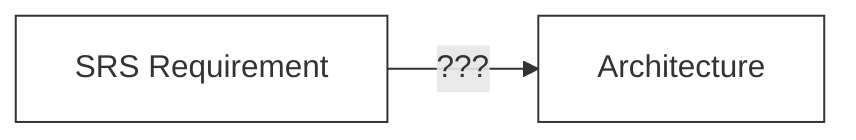
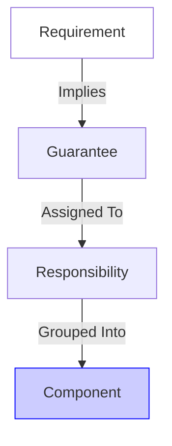

# Course — From Requirement to Architecture
## The Missing Link — Sequence 04

## Course Intention

This course explains **the intellectual transition** between formal requirements (SRS) and software architecture.
It discusses **neither language nor framework**.

It is the **missing link** between:

*Many developers skip this link. They read a requirement and guess an architecture. This course fills the gap with logic.*

---

## 1. The Fundamental Problem

A requirement says:
> *"The system guarantees X."*

But it never says:
-   **Who** is responsible for X.
-   **Where** this rule lives.
-   **How** it is protected.

### Real-World Analogy

> **The Translator**
>
> An architect receives a client request: *"I want a quiet bedroom."* (Requirement).
> The architect translates this into: *"Install double-glazed windows and soundproof drywall."* (Responsibility).
>
> If the architect just wrote "Quiet Room" on the plan without assigning materials, the builder would build a noisy room. **You cannot "build" a requirement directly. You must translate it into a physical component.**

---

## 2. Shift in Posture: From Reader to Decider

*   **Developer**: "Where do I code this?"
*   **Engineer**: "Who must carry this responsibility so the guarantee remains true?"

---

## 3. The Thread

Any serious architecture rests on this immutable logic chain:

**Requirement → Guarantee → Responsibility → Structure**

#### Diagram Analysis
1.  **Requirement**: "Users must be unique." (Text)
2.  **Guarantee**: "The system must reject any write operation where email equals existing email." (Logic)
3.  **Responsibility**: "The User Store must check uniqueness before Write." (Ownership)
4.  **Component**: "Database Constraints" OR "Auth Service". (Structure).

**We moved from Text -> Logic -> Ownership -> Structure.**

---

## 4. Methodical Steps

### Step 1: Identify Nature
Is it a Business Rule (Logic)? An Invariant (Safety)? A Policy (Config)? A Process (Flow)?

### Step 2: Transform into Guarantee
Reformulate "Must do X" into "The System guarantees that X...".
This forces you to think about edge cases.

### Step 3: Assign Responsibility
> **One Guarantee = One Primary Responsibility.**
If "Everyone" is responsible for security, "No one" is responsible. Pick one owner.

### Step 4: Group Responsibilities
Observe which responsibilities evolve together (Cohesion) and which stay apart (Decoupling).
*   *Example*: "Calculating Tax" and "Generating Invoices" often change together -> Group them.

### Step 5: Emergence of Components
When responsibilities are cohesive and stable, they form a **Conceptual Component**.
This component naturally becomes a Class, a Module, or a Microservice.

---

## 5. Explicit Link with UML & C4

This course **does not replace UML**. It explains **why** we draw diagrams.

-   **UML** describes the behavior of these responsibilities.
-   **C4** structures the boundaries of these responsibilities.

---

## Real Skill Gained

After this course, you stop assembling code and start **designing systems**.
You can:
-   Justify why a rule lives in the Database vs the API.
-   Defend a boundary without speaking about "Microservices".

---

## Position in Series

This course sits **after**:
-   [03_design_contract_invariants.md](./03_design_contract_invariants.md)

And **before**:
-   [05_modeling_uml_c4.md](./05_modeling_uml_c4.md)
