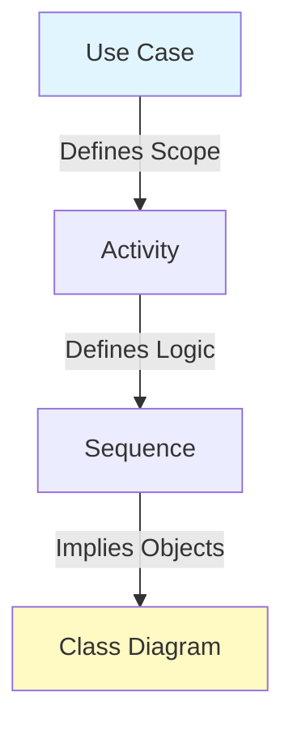

# Course — System Modeling (UML & C4)
## Engineer Version — Sequence 05

---

## Course Objective

This course teaches **how to think, analyze, and model a system before coding**.
It focuses on the separation of concerns between **Structure** and **Behavior**.

---

## 1. Mental Foundations: Structure vs. Behavior

Before drawing, separate two dimensions:

### Real-World Analogy

> **Anatomy vs. Physiology**
>
> *   **Structure (C4)** is Anatomy: The skeleton, organs, connections. (Static). *Example: Bones don't move unless muscles pull them.*
> *   **Behavior (UML)** is Physiology: How blood pumps, how nerves fire. (Dynamic). *Example: Running is a behavior that uses bones.*
>
> You cannot understand a body with only a skeleton model. You need both.

### 1.1 Behavior (Dynamic)
*   **Question**: What does the system do?
*   **Tools**: Sequence Diagrams, Use Case, Activity.
*   **Check**: Does it show *time* or *flow*? Then it's behavior.

### 1.2 Structure (Static)
*   **Question**: What are the pieces?
*   **Tools**: Class Diagrams, Component Diagrams, C4 Model.
*   **Check**: Does it show *relationships* or *nesting*? Then it's structure.

**Golden Rule**: Describe behavior first. Structure is the answer to behavior.

---

## 2. UML — Locking down Behavior

UML is versatile. Use it to answer "How?".

**Visual Map**:

#### Diagram Analysis
This diagram shows the *Derivation Flow*.
1.  **Use Case**: First, we list features.
2.  **Activity**: Then, we draw the "Flowchart" of decisions.
3.  **Sequence**: Then, we see which objects talk to each other to execute that flow.
4.  **Class (Static)**: Finally, we define the Classes to support those objects.
**Do not start with the Class Diagram.**

### 2.1 Dynamic Diagrams
-   **Use Case**: Actors & Goals. "User wants to Login".
-   **Sequence**: Timeline of interactions. "User -> AuthSvc -> DB".
-   **Activity**: Decision trees & Logic. "If invalid password -> Redirect".

### 2.2 Static Diagrams
-   **Class**: Entities & Relations. "User has one Profile".
-   **Component**: Logical modules. "Billing Module".

---

## 3. C4 — The Global Structure

C4 focus on **Hierarchy** and **Boundaries**. Think of it as Google Maps zoom levels.

| Level | Question | Typical Content | Detail Level |
|:---|:---|:---|:---|
| **Context** | Where does it fit? | Users, External Systems (Stripe, AWS). | Continents |
| **Container** | What services exist? | Web App, API, Database, Mobile App. | Countries |
| **Component** | How is it structured? | Controllers, Services, Repositories. | Cities |
| **Code** | Implementation? | Classes, Interfaces (Optional). | Streets |

**Engineer's Rule**: C4 structures the system; UML explains the internal interactions.

---

## 4. Recommended Modeling Order

1.  **C4 Context** (Environment): Draw the box around your system. Who talks to it?
2.  **UML Use Case** (Scope): What are the features inside the box?
3.  **UML Sequence** (Interaction Logic): Pick the hardest feature. How does it work?
4.  **C4 Container** (Architecture choice): "We need a React App and a Go API to handle this."
5.  **C4 Component** (Internal design): "The Go API needs a PaymentController."

---

## 5. Common Pitfalls

-   **Mixing Structure and Behavior**: Drawing an arrow that means "Calls API" and another that means "Is located in" on the same diagram.
-   **Drawing UML just for documentation**: Only draw what you need to understand. If it's obvious, don't model it.
-   **Skipping C4 Context**: Forgetting that your system talks to Stripe or Email Services.

---

## 6. Expected Result

After this course, an engineer can:
-   Separate Structure from Behavior.
-   Choose the right diagram for the right question.
-   Lock down invariants before writing code.

**This course becomes the solid base effectively replacing "guessing" with "engineering".**
